C++ notebook

## 一、C++基础知识

### 1.初识C++

#### 1.1 书写代码基本框架

  

> 文本输出框架     

         
#### 1.2 注释

> 单行注释：// 描述信息

> 多行注释：/* 描述信息 */

注释后 字体会变绿

介绍 main 函数 ： main是一个程序入口，每个程序有且仅有一个

#### 1.3 变量

**作用：**给内存空间起名，方便管理内存空间

> 语法：数据类型 变量名 = 变量初始值；

#### 1.4 常量

**作用：**用于记录不可更改的数据

C++定义常量两种方式

1. **#define 宏常量**  (函数体外)

   > #define 常量名 常量值

    通常在文件上方定义， 表示一个常量

2. **const修饰的变量**  （函数体里）

   > const 数据类型 常量名 = 常量值

​         通常在变量定义前加关键字const， 修饰该变量为常量，不可修改

       
#### 1.5 关键字

**作用**：关键字是C++中预先保留的单词（标识符）

**在定义变量或者常量时候，不要用关键字**

  

#### 1.6 标识符

- 标识符不能是关键字，只能由字母、数字、下划线组成
- 第一个字符必须是字母或者下划线
- 标识符中字母区分大小写

**建议**：给变量取名时做到见名知意。

###  2 数据类型

存在意义：给变量分配一个合适的内存空间

#### 2.1 整型

整型变量表示的是**整数类型**的数据

**代码举例**

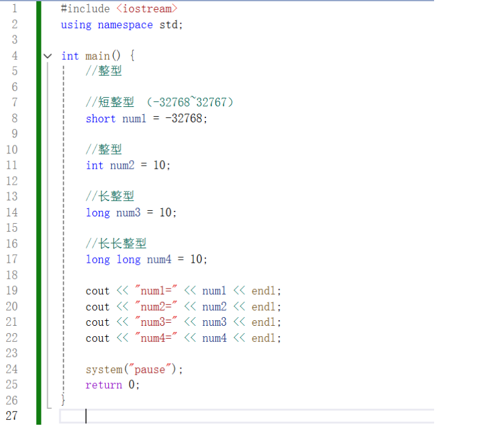

#### 2.2 sizeof关键字

**作用**：利用其来求出数据类型占用内存大小

**语法**：`sizeof（数据类型/变量）`

整型大小比较： short < int <= long <= long long  

        
#### 2.3 实型 （浮点型）

**作用**：用于表示小数

**浮点型变量分为两种：单精度float     双精度double**

  

默认编译器会认为小数是双精度，小数后加 f 会认为是单精度

默认情况下 输出一个小数，会显示出6位有效数字

#### 2.4 字符型

**作用：**字符型变量用于显示单个字符

**语法：**`char ch = 'a' ;`

`注意：` 

`在显示字符型变量时，用单引号将字符括起来，不用双引号；`

`单引号内只能有一个字符，不可以是字符串`

- C和C++中字符型变量只占用1个字节
- 字符型变量是将对应的ASCII码编码放入到存储单元
- ASCII码对应： a-97， A-65

**代码：**

#### 2.5 转义字符

表示一些不能显示的ASCII码

常用的转义字符有 ：\n(换行符)  \\\ (反斜杠)  \t(水平制表符)

**代码：**

#### 2.6 字符串型

**作用：**用于表示一串字符

**C风格字符串：**`char 变量名[] = "字符串值";`

`注意： char 字符串名 []`  

​             `等号后面要用双引号，包含起来字符串`

**C++风格字符串：** `string 变量名 = "字符串值";`

`使用时要加入头文件 #include <string>`

    
#### 2.7 布尔类型 bool

**作用：** 代表真或假的值

bool类型只有两个值：

true --- 真（本质是1）

false --- 假（本质是0）

**bool类型占1个字节大小**。

**代码：**

    
#### 2.8 数据的输入

**作用：** 用于从键盘获取数据

**关键词：** cin

**语法：**`cin >> 变量`

**代码：**整型 、浮点型、字符型、字符串型、布尔型

  

### 3 运算符

用于执行代码的运算

#### 3.1 算术运算符

!(./images/image-20250112183111434.png)

**注意：两个小数是不可以做取模运算的。**

##### 前置后置递增运算符

1.前置递增 ：让变量+1 ++a

2.后置递增：让变量＋1 a++

**区别：**前置递增 先让变量+1，然后进行表达式计算

 先+1再计算

​            后置递增 先进行表达式运算，后让变量＋1

先计算再+1

后置递减运算符

#### 3.2 赋值运算符

a+=2  就是 a=a+2 

#### 3.3 比较运算符

用于表达式的比较，并返回一个真值或假值。

 **注意**：输出时记得加小括号！

#### 3.4 逻辑运算符

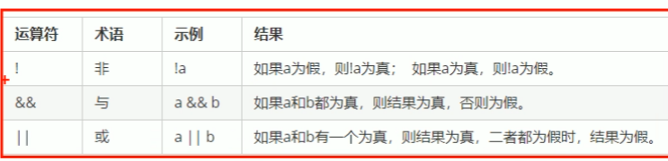

用于根据表达式的值返回真值或假值

在C++中 除了0 都为真

### 4 程序流程结构

顺序结构 选择结构 循环结构

- 顺序结构：程序按顺序执行，不发生跳转
- 选择结构：依据条件是否满足，有选择的执行相应功能
- 循环结构：依据条件是否满足，循环多次执行某段代码

#### 4.1 选择结构

##### 4.1.1 if语句

执行满足条件的语句

if语句的三种形式

- 单行格式
- 多行格式
- 多条件

**单行格式if条件语句**    `if (条件) { 条件满足执行的语句 }`

**注意：if条件后面不要加分号**

**多行格式if条件语句**  

`if (条件) { 条件满足执行的语句} else {条件不满足执行的语句}；`

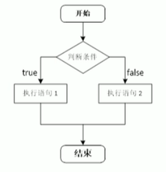

 

**多条件的if语句**

`if (条件1){ 条件1满足执行的语句} else if (条件2) {条件2满足执行的语句} ... else {都不满足执行的语句}`

**嵌套if语句**

案例 比大小

##### 4.1.2 三目运算符

`表达式1？ 表达式2：表达式3`

如果表达式1的值为真，执行表达式2，并返回表达式2的值

如果表达式1的值为假，执行表达式3，并返回表达式3的值

在C++中 三目运算符返回的是变量，可以继续赋值 

##### 4.1.3 switch语句

执行多条件分支语句

语法：

if和switch的区别：

**switch缺点，判断时候只能是整型或者字符型，不可以是一个区间**

#### 4.2 循环结构

##### 4.2.1 while循环语句

满足循环条件，执行循环语句

`while(循环条件){循环语句}`

系统生成随机数函数： 

**rand()%**范围

添加随机数种子，作用利用当前系统时间生成随机数，防止每次随机数都一样

加入time系统时间头文件包含

`#include<ctime>`

`srand( (unsigned int) time(NULL) );`

**break**， 可以利用其来终止循环。

猜数字：

##### 4.2.2 do...while 循环语句

do{循环语句}while{循环条件}

与while的区别在于 do...while会先执行一次循环语句，再判断循环条件。

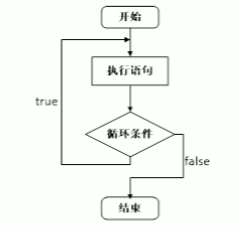

水仙花树

1.输出所有的三位数

2.在所有的三位数中找到水仙花树

获取个位 对数字取模于10 可以获取各位

十位 先整除于10，得到两位再取模于10

和百位  整除于100

判断 如果个位^3+十位^3+百位^3=本身

##### 4.2.3 for循环语句

可以设置循环次数

语法：`for(起始表达式；条件表达式；末尾循环体) { 循环语句; }`

0123123123...

7的倍数怎么找？

取模于7等于0 即为7的倍数

##### 4.2.4 嵌套循环

 利用嵌套循环实现*图

 

外层执行一次，内层执行一周

乘法口诀表

列数 <= 当前的行数

#### 4.3 跳转语句

##### 4.3.1 break 跳转语句

##### 4.3.2 continue 语句

在循环语句中，跳过本次循环中余下尚未执行的语句，继续执行下一次循环

continue：执行到当前行后就不再执行后面的代码了，重新进入下次循环

##### 4.3.3  go to 语句

可以无条件跳转语句

`goto 标记；`

### 5 数组

#### 5.1 概述

所谓数组，就是一个集合，里面**存放了相同类型的数据元素**

**特点1：**数组中每个数据元素都是相同的数据类型

**特点2：**数组是由连续的内存位置组成的

#### 5.2 一维数组 array

##### 5.2.1 一维数组定义方式

一堆数组定义的三种方式：

1. `数据类型 数组名[ 数组长度 ]`
2. `数据类型 数组名[ 数组长度 ] ={ 值1，值2 ...}`
3. `数据类型[ ] = { 值1，值2 ... }`

数组元素的下标是从0开始索引的。

如果在初始化数据时，没有全部填写完，会用0填充。

定义数组时，必须有初始长度。

##### 5.2.2 一维数组数组名

1.可以**统计**整个数组在内存中的**长度**   `sizeof (数组名)`

2.可以**获取**数组在内存中的**首地址**

`cout << (int)arr <<endl;`

数组中元素地址

 cout << (int)&arr[元素下标] <<endl;

**数组名是一个常量，不可以进行赋值操作**

长度不固定的话 使用

数组长度/单个元素的长度+1 来实现得到末尾元素的下标。

##### 5.2.3 冒泡排序

排序总轮数= 元素个数（数组长度）-1 （外层）

每轮对比次数= 元素个数（数组长度）-排序轮数-1  （内层） 

 

#### 5.3 二维数组

##### 5.3.1 二维数组定义方式

二维数组定义的四种方式：

1. `数据类型 数组名  [行数] [列数]；`

   

2. `数据类型 数组名 [ 行数 ] [列数 ]={ {数据1，数据2}，{数据3，数据4} }；`

   

3. `数据类型 数组名 [行数] [列数]={ 数据1， 数据2，数据3，数据4}；`

   

4. `数据类型 数组名 [  ] [列数]={ 数据1，数据2，数据3，数据4 }；`

   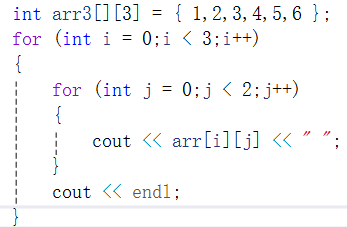

先行后列

**必须有列！！**

##### 5.3.2 二维数组数组名

查看二维数组所占内存空间大小

`sizeof（数组名）；`

获取二维数组首地址

`& 取值符`

### 6 函数

#### 6.1 概述

#### 6.2 函数的定义

函数的定义一般主要有 5个步骤：

1.返回值类型

2.函数名

3.参数列表

4.函数体语句

5.return 表达式

**语法：**

`返回值类型 函数名 （参数列表）`

`{`

​           `函数体语句`

​            `return 表达式`

`}`

#### 6.3 函数的调用

`函数名（参数）`

#### 6.4 值传递

函数调用时实参将数值传入给形参

值传递时，如果形参发生变化，并不会影响实参

**当函数声明时，不需要返回值时 使用 void 而且不需要写 return**

#### 6.5 函数的样式

无参无返

有参无返

无参无返

有参有返

#### 6.6 函数的分文件编写

函数分文件编写的4个步骤：

1、创建后缀为 .h 的头文件

2、创建后缀为 .cpp 的源文件

3、在头文件中写函数的声明

4、在源文件中写函数的定义

### 7 指针

通过指针间接访问内存。

- 内存编号从0开始记录，一般用十六进制数字表示
- 可以利用指针变量保存地址

#### 7.1 指针变量的定义和使用

语法： `数据类型 * 变量名；`

int * p;

p=&a;  & 取址符号   这是变量所在内存空间的**地址**

a =*p;  * 解引用    使用指针——解引用 可以找到指针指向的内存中的**数据**。

指针就是地址！

#### 7.2 指针所占内存空间

不管指针为什么数据类型，所在的内存空间都为4个字节。

x86 32位操作系统，占用4个字节；

x64 64位操作系统，占用8个字节；

`int * p = &a;`

#### 7.3 空指针和野指针

**空指针：**指针变量指向内存空间中编号为0的空间

用途：初始化指针变量

`int *  p = NULL;`  

注意：空指针指向的内存是不可以访问的

0~255 这一段内存空间编号是系统占用的，是不可以访问的。

**野指针：**指针变量指向非法的内存空间

在程序中，尽量避免使用空指针和野指针，这些都不是我们申请的空间。

#### 7.4 const修饰指针

- const 修饰指针，——常量指针

  const **int *** p =  &a;

  指针指向可以改，指针指向的值不可以改

  举例： 

  p=&b；正确，因为指向可以改

  *p=100；错误，因为指向的值不可以改

  

  

  

- const 修饰常量，——指针常量

  int * const **p** =&a;

  指针的指向不可以改，指针指向的值可以改。

  p=&b； 错误，指针的指向不可以改。

  *p=100； 正确，指针指向的值可以改。

  

- const既修饰指针，又修饰常量。

const int * const * p= &a；

指针指向的值和指针的指向都不可以改

p=&b； 错误

*p=100； 错误

 看到*叫指针！！！

 const修饰什么 写代码时就不能修改什么。

#### 7.5 指针和数组

利用指针来访问数组中的元素。

#### 7.6 指针和函数

利用指针作函数参数，可以修改实参的值

值传递不修改实参的值，地址传递可以修改实参的值。

交换地址，地址对应的是真实的参数，所以实参可以改变。

而值传递相当于将实参的数值传递给形参，形参发生相应的变化而已，所以实参不会改变。

#### 7.7 指针、数组、函数

数组要传递到函数中，就要使用指针。

### 8 结构体

结构体属于用户自定义的数据类型，允许用户存储不同的数据类型。

#### 8.1 结构体的定义和使用

语法：`struct 结构体名 {结构体成员列表}；`

自定义的数据类型就是一些类型的集合。

创建结构体变量的三种方式

1、`struct 结构体名 结构体变量`

给变量赋值，通过 . 访问结构体变量中的属性

2、`struct 结构体名 结构体变量 ={...}`

3、定义结构体的时候顺便创建一个结构体变量

**struct关键字在创建变量时可以省略**

#### 8.2 结构体数组

将自定义的结构体放入数组中方便维护

`struct  结构体名 数组名[元素个数]={{}，{}，... ,{}}；`

#### 8.3  结构体指针

用指针来访问结构体中成员

#### 8.4 结构体嵌套结构体

#### 8.5 结构体做结构参数

将结构体作为参数向函数中传递

两种传递方式： 值传递和地址传递

 

#### 8.6 结构体中const使用场景

将函数中的形参改为指针，可以减少内存空间，而且不会复制新的副本出来。 指针永远是4个字节！

#### 8.7 案例

### 通讯录管理系统

#### 1.菜单功能

用户选择功能的界面

#### 2.退出功能

选择switch语句搭好，根据用户不同的选择，执行不同的功能

#### 3.添加联系人

1、判断通讯录是否已满

2、添加联系人 （封装成一个函数）使用地址传递

清屏操作 system("cls");

#### 4、显示联系人

1、判断联系人是否为空

2、显示联系人 封装成一个函数

#### 5、删除联系人

按照姓名进行删除指定联系人的操作

1、封装检测联系人是否存在的函数

2、封装删除联系人函数

#### 6、查找联系人

按照姓名进行查找指定联系人的操作

1、判断联系人是否存在

2、封装查找联系人的函数

#### 7、修改指定的联系人

按照姓名重新修改指定联系人

查找用户输入的联系人，如果查找成功，则修改，否则查无此人

#### 8、清空联系人

封装清空联系人的函数

## 二、C++核心编程

编程思想：面向对象

### 1 内存分区模型

代码区 全局区 栈区 堆区

为了灵活编程

代码区：存放函数体的二进制代码，由操作系统进行管理

#### 1.1 程序运行前

在程序编译前，生成了exe可执行程序，

未执行该程序前分为两个区域：

**代码区**

存放CPU可执行的机器指令，二进制

代码区共享，目的是对于频繁被执行的程序，只需要内存中有一份代码即可

代码区只读，目的是防止程序意外修改它的指令

**全局区**

存放**全局变量**和**静态变量**

全局区还包括了**常量区**，字符串常量和其他常量（const修饰的变量）

特点：该区域的数据在程序结束后**由操作系统释放**

**全局变量**在函数体之外

**局部变量**在函数体内（例如main函数）

**静态变量** 在普通变量前加static 属于静态变量

**常量**：字符串常量和const修饰的变量

双引号内的字符串 称为**字符串常量**

**const修饰的变量**，**还分为** 

const修饰的全局变量称为**全局常量**，在全局区

const修饰的局部变量称为**局部常量**，不在全局区！！！

#### 1.2 程序运行后

**栈区**：**由编译器自动分配释放**，存放函数的参数值（形参），局部变量等

注意：：**不要返回局部变量的地址**，栈区开辟的数据由编译器自动释放

函数执行完后自动释放

若强制返回了局部变量的地址，编译器会做一个保留

**堆区：** **由程序员分配释放**，程序结束后由操作系统回收

**在C++主要利用 new 在堆区开辟内存**

`int *p  =  new int(10) ;`

指针 本质也是局部变量，放在栈上，指针保存的数据是放在堆区

相当于 地址保存在栈区，指向堆区的数据

#### 1.3 new操作符

堆区开辟的数据，由**程序员手动开辟，手动释放**，**释放利用操作符 delete**

**new返回是 该数据类型的指针**

`new 数据类型`

**开辟数据**

int *p=new int (10） ;  10代表这个指针中存放的数据值为10

**开辟数组**

int * arr = new int [10]; 10代表数组里有10个元素

释放数组 用delete[ ] 才可以

例如 delete[ ] arr;

### 2 引用

#### 2.1 引用的基本使用

给变量起别名

`数据类型 &别名 = 原名`

####  2.2 引用注意事项

1、引用必须要初始化！

 int &b；  // 错误的

2、引用一旦初始化后不可更改

#### 2.3 引用做函数参数

函数传参时，可以利用引用的技术让形参修饰 实参

引用传递中的形参 用的是别名 相当于还是对变量本身做改动

值传递相当于赋值了，所以实参本身不会发生改变

#### 2.4 引用做函数返回值

注意事项： 

**1、** **不要返回局部变量的引用**

**2、函数的调用可以作为左值**

相当于 可以赋值

 如果函数的 返回值类型 是引用，这个函数调用可以作为左值

#### 2.5 引用的本质

就是一个指针常量

int& ref =a ；

等同于 ： int * const ref = &a；

指针常量 的特点是 指针的指向不可以更改，所以ref会被称之为a 的别名

#### 2.6 常量引用

常量引用 修饰形参 防止误操作

引用必须引一块合法的内存空间

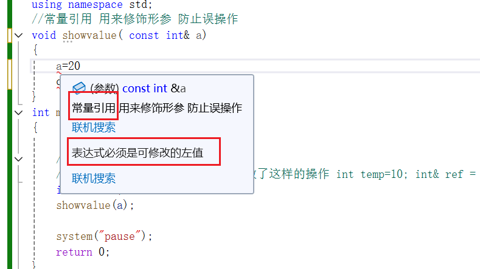

### 3 函数提高

#### 3.1 函数的默认参数

在C++中，函数的形参列表中的形参是可以有默认值的。

语法：`返回值类型 函数名 （参数=默认值）{}`

int add （int a=10,int b=20）{ }

注意事项：

1. 如果某个位置已经有了默认参数，那么从这个位置往后，从左到右都必须有默认值

2. 如果函数的声明（头文件.h）有了默认参数，那么函数的实现（.cpp）就不能有默认参数。

#### 3.2 函数占位参数

C++的形参列表里可以有占位参数，用来做占位，调用函数时必须填补该位置。

语法： `返回值类型 函数名 （数据类型）{}`

占位参数还可以有默认参数

#### 3.3 函数重载

函数名可以相同，提高复用性

函数重载满足条件：

- 同一个作用域下
- 函数名称相同
- 函数**参数类型不同** 或者 参数**个数不同** 或者**参数顺序不同**

 函数的返回值不可以作为函数重载的条件。

##### 函数重载注意事项

两种情况：

- 引用作为重载条件

  加const和不加const 可以作为重载条件

形参的类型不同 看使用函数时传入的数据是什么类型

- 函数重载碰到默认参数

会出现二义性 ，要避免出现这种情况

### 4 类和对象

**C++面向对象的三大特性 ：封装、继承、多态**

具有相同性质的**对象**，我们可以抽象为**类**

#### 4.1封装

##### 4.1.1 封装的意义

意义： 

- 将属性和行为作为一个整体，表现生活中的事物
- 将属性和行为加以权限控制

通过类 创建 对象 ，再给对象的属性进行赋值。

class 类名{

权限：属性\行为}

`类 类似于 结构体中变量也可以用函数来添加`。

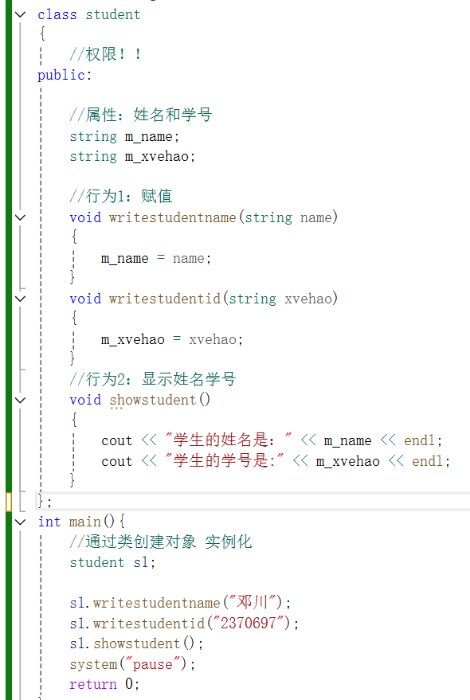

类中的属性和行为 都叫为成员

属性 成员属性 成员变量

行为 成员函数 成员方法

 **访问权限有3种：**

1. **public 公共权限** ：成员在类内和类外都可以访问

2. **protected 保护权限** ：成员在类内可以访问，在类外不可以访问

   儿子可以访问父亲中保护的内容

3. **private 私有权限** ：成员在类内可以访问，类外不可以访问

儿子不可以访问父亲的私有内容

只有 name 是公共权限下的，所以在类外可以访问

##### 4.1.2 struct和class区别

默认的访问权限不同

struct 默认访问权限是 公有 public

class默认访问权限是 私有 private

##### 4.1.3 成员属性设置为私有

优点1：将所有成员属性设置为私有，可以自己控制读写权限

优点2：对于写权限，我们可以检测数据的有效性

将属性私有，通过行为使得数据可读可写。

#### 立方体

#### 点和圆的关系

**第一种：都在一个CPP文件中**

**第二种：封装 类**

#### 4.2 对象的初始化和清理

##### 4.2.1 构造函数和析构函数

对象的初始化和清理是两个非常重要的安全问题。

C++利用构造函数和析构函数解决对象的初始化和清理问题，函数将会被编译器自动调用，且是编译器强制我们要做的事情

因此如果我们不提供构造和析构，编译器会提供。

**编译器提供的构造函数和析构函数是空实现。**

- 构造函数：作用是创建对象时为对象的成员属性赋值。
- 析构函数：作用是对象销毁前自动调用，执行一些清理工作。

**构造函数语法：**`类名( ){ }`

1. 没有返回值也不写void
2. 函数名称和类名相同
3. 构造函数可以有参数，因此可以发生重载
4. 程序在调用（创建 ）对象时候会自动调用构造，无需手动调用，而且只会调用一次。

**析构函数语法：**`~类名(){}`

1.没有返回值也不写void

2.函数名称和类名相同，在名称前加符号~

3.析构函数不可以有参数，因此不可以发生重载

4.程序在对象销毁前会自动调用析构，无需手动调用，而且只会调用一次。

**对象执行完后才会调用析构函数**

##### 4.2.2  构造函数的分类及调用

分类：

按照参数分类：有参构造和无参构造（默认构造）

按照类型分类：普通构造和拷贝构造

**注意1：**调用默认构造函数时，不要加（）。 如果加上（）例如 person（），编译器认为会是一个函数的声明，不会认为在创建对象。

**注意2：**拷贝构造函数要加以限定，以防修改之前的数据。其次还需要用引用的方式传入

语法： `类名(const 相同类名 &对象 ){ }`

调用构造函数的三种方法：

括号法 显示法 隐式转换法

// **`Person(10);`** //**匿名对象 特点：**

当前行执行结束后，系统会立即回收掉匿名对象

**注意3：**不要利用拷贝构造函数 初始化匿名对象 编译器会认为 Person(p3) === Person p3;对象重定义

##### 4.2.3 拷贝构造函数调用时机

三种情况：

使用一个已经创建完毕的对象来初始化一个新对象；

值传递的方式给函数参数传值；

值传递 就是拷贝一个临时的副本出来 所以也就是调用了拷贝构造函数

值方式返回局部对象。

函数体内 都是局部对象

##### 4.2.4 构造函数调用规则

默认情况下，c++编译器至少给一个类添加3个函数

1.默认构造函数（无参，函数体为空）

2.默认析构函数（无参，函数体为空）

3.默认拷贝构造函数，对属性进行值拷贝

构造函数调用规则如下：

- 如果用户定义有参构造函数，c++不再提供默认无参构造，但会提供默认拷贝构造。
- 如果用户定义拷贝构造函数，c++不会再提供其他构造函数。

##### 4.2.5 深拷贝与浅拷贝

浅拷贝：简单的赋值拷贝操作

深拷贝：在堆区重新申请空间，进行拷贝操作

析构代码，将堆区开辟数据做释放操作

**浅拷贝带来的问题是 堆区的内存重复释放。**

浅拷贝的问题用深拷贝来进行解决

 **注意：**如果属性有在堆区开辟的，一定要自己提供拷贝构造函数，防止浅拷贝带来堆区内存重复释放的问题。

##### 4.2.6 初始化列表

c++提供了初始化列表语法，用来初始化属性。

语法： `构造函数():属性1(值1)，属性1(值1)...{}`

##### 4.2.7 类对象作为类成员

C++类中的成员可以是另一个类的对象，我们称该成员为 对象成员

class A { }

class B

{

​     A  a;

}

B类中有对象A作为成员，A为对象成员。

先有A，后有B

构造顺序：当其他类对象作为本类成员，构造时候先构造类对象，再构造自身；

析构顺序：与构造相反

先析构B，后析构A

##### 4.2.8 静态成员

静态成员就是在成员变量和成员函数前加上关键字static，称为静态成员

静态成员分为：

**静态成员变量：** （不属于某个对象上）

- 所有对象共享同一份儿数据
- 在编译阶段分配内存
- 类内声明，类外初始化

**静态成员函数：**

- 所有对象共享同一个函数
- 静态成员函数只能访问静态成员变量

**静态成员变量**有两种访问方式：

1.通过对象进行访问

2.通过类名进行访问

静态成员变量也是有访问权限的。

类外访问不到私有静态成员变量

静态成员函数有两种访问方式：

1.通过对象访问

2.通过类名访问

静态成员函数 不可以访问非静态成员变量，无法区分到底是哪个对象的属性。

静态成员函数也是有访问权限的

#### 4.3 c++对象模型和this指针

##### 4.3.1 成员变量和成员函数分开存储

在C++中，类内的成员变量和成员函数分开存储

且 只有非静态成员变量才属于类的对象上

**空对象**占用内存空间为：1

c++编译器会给每个空对象也分配一个字节空间，是为了区分空对象占内存的位置。

每个空对象也应该有一个独一无二的内存地址。

##### 4.3.2 this 指针概念

每一个非静态成员函数只会诞生一份函数实例，也就是说多个同类型的对象会共用一块代码

c++通过提供特殊的**对象指针，this指针**，解决该问题——**共用的一块函数代码如何区分是哪个对象调用的自己。**

**this指针指向被调用的成员函数所属的对象**

this指针隐含在每一个非静态成员函数内

且不需要定义，直接使用即可

**this指针的用途：**

- 当形参和成员变量同名时，可用this指针来区分
- 在类的非静态成员函数中返回对象本身，可使用 return *this

##### 4.3.3 空指针访问成员函数

c++空指针也是可以调用成员函数的，但要注意有没有用到this指针

  传入的指针是空指针 就不能调用类内的属性。

预防空指针的存在，提高代码的健壮性。

##### 4.3.4 const修饰成员函数

常函数：

- 成员函数后加const后我们称之为是常函数
- 常函数内不可以修改 成员属性
- 成员属性声明时加关键字mutable后，在常函数中依然可以修改。

常对象：

- 声明对象前加const称该对象为常对象，不可以修改成员属性，加上关键词mutable 可以修改。
- 常对象只能调用常函数

 

this指针的本质 是指针常量，指针的指向是不可以修改的。

如果想要指针指向的值也不可以修改 那么就要在成员函数后面 const，

在成员函数后加const，修饰的是this的指向，让指针指向的值也不可以修改。

常对象不可以调用普通成员函数，因为普通成员函数可以修改属性

#### 4.4 友元

在程序里，有些私有属性 也想让类外特殊的一些函数或者类进行访问，就需要友元的技术

**友元的目的就是让一个函数或者类 访问另一个类中私有成员**

友元的关键字  **friend**

友元的三种实现：

- 全局函数做友元
- 类做友元
- 成员函数做友元

##### 4.4.1 全局函数做友元

在类中写入全局函数的声明，并在前加上 friend 关键字。

##### 4.4.2 类做友元

##### 4.4.3 成员函数做友元

#### 4.5 运算符重载

对已有的运算符重新进行定义，赋予其另一种功能，以适应不同的数据类型。

##### 4.5.1 加号运算符重载

两个自定义的数据类型相加

operator+

方法：

1.通过成员函数重载加号

本质：person p3=p1+p2;

代码本质： person p3=p1.person operator+（p2）

2.通过全局函数重载加号

本质：person p3 =p1+p2；

代码本质：person p3=operator+（p1，p2）；

注：运算符重载也可以发生函数重载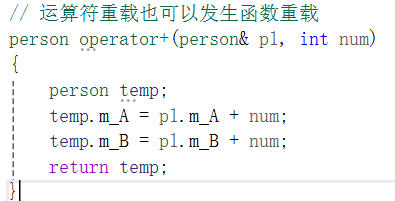

##### 4.5.2 左移运算符重载

输出自定义数据类型

不会利用成员函数来实现左移运算符重载，因为无法实现 cout在左侧

**利用全局函数重载左移运算符**

cout到底是什么数据类型？

输出流 ostream 数据类型！

##### 4.5.3 递增运算符重载

重载递增运算符，实现自己的整型数据

**重载前置++运算符**

如果返回的是值，而不是类型，那么相当于是返回的拷贝值，之后的操作也是对拷贝值进行，而不是原来的值，这样的话，原来的值是不变的。

返回引用 是为了对同一个数据进行操作

**重载后置++运算符**

后置递增返回值：因为要先记录当前值。

后置递增不可以链式编程。

##### 4.5.4 赋值运算符重载

c++编译器至少给一个类添加4个函数

1.默认构造函数（无参，函数体为空）

2.默认析构函数（无参，函数体为空）

3.默认拷贝构造函数，对属性进行值拷贝

4.赋值运算符operator= 对属性进行值拷贝

如果类内有属性指向堆区，做赋值操作时也会出现深浅拷贝问题。

##### 4.5.5 关系运算符重载

可以让自定义数据类型对象进行对比操作

##### 4.5.6 函数调用运算符重载

函数调用运算符（）也可以重载

由于重载后使用的方式非常像函数的调用，因此称为仿函数

仿函数没有固定写法，非常灵活

#### 4.6 继承

继承是面向对象三大特性之一

继承解决算法冗余的问题

减少重复代码

语法： `class 子类 ：继承方式  父类`

子类也称为 派生类

父类也称为 基类

派生类中的成员，包含两个部分：

一类是从基类继承过来的，一类是自己增加的成员

从基类继承过来的表现其共性，而新增的成员体现其个性。

##### 4.6.1 继承方式

三种继承方式：公有继承、保护继承、私有继承

**父类私有不可访问，公有继承权限不变，保护继承全变成保护，私有继承全变成私有**

保护权限：类内可以访问，子类可以访问，类外不可以访问，

私有权限：类内可以访问，子类和类外都不可以访问。

##### 4.6.2 继承中的对象模型

**父类中所有的非静态成员属性都会被子类继承下去**

父类的私有成员属性是被编译器隐藏了，因此访问不到，但是确实是被继承下去了

利用开发人员命令提示工具查看对象模型：

 

##### 4.6.3 继承中构造和析构顺序

先构造父类，再构造子类

析构顺序相反

##### 4.6.4 继承同名成员处理方式

当子类和父类出现同名的成员，如何通过子类对象，访问到子类或父类中同名的数据呢？

- 访问子类同名成员 直接访问即可
- 访问父类同名成员 需要加作用域

 如果子类中出现和父类同名的成员函数，子类的同名成员会隐藏掉父类中的所有同名成员函数。

如果想访问父类中被隐藏的同名成员函数，要加作用域

##### 4.6.5 继承中同名静态成员处理方式

 

同名静态成员处理方式与非静态处理方式一样，只不过有两种访问的方式

通过对象和通过类名

##### 4.6.6 多继承语法

c++ 允许一个类继承多个类

语法：`class 子类：继承方式 父类1，继承方式 父类2 ....`

多继承需要加作用域，防止同名成岩引发问题。

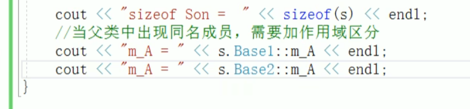

##### 4.6.7  菱形继承

1. 羊继承了动物的数据，驼同样也继承了动物的数据，当草泥马使用数据时产生二义性。

​      **解决方法： 加作用域来区分**

2. 草泥马继承自动物的数据继承了两份，导致资源浪费且毫无意义，只需要一份儿就可以。

   **解决方法：利用虚继承 **

**继承之前 加上关键词 virtual 变为虚继承**

最上面的类称为 虚基类

vbptr ：virtual base pointer 虚基类指针

加上virtual后继承的是两个指针，而不是两个数据，两个指针会通过偏移量指向 唯一的数据

#### 4.7 多态

##### 4.7.1 多态的基本概念

多态是C++面向对象三大特性之一

多态分为两类：

- 静态多态：函数重载 和 运算符重载属于静态多态，复用函数名
- 动态多态：派生类和虚函数实现运行时多态

静态多态和动态多态的区别：

静态多态的函数地址早绑定----编译阶段确定函数地址

动态多态的函数地址晚绑定----运行阶段确定函数地址

c++允许父类和子类之间的直接调用

函数前加 virtual，称为虚函数。

**动态多态满足的条件：**

1.有继承关系

2.子类要有父类函数的重写。

重写：函数返回值类型 函数名 参数列表 完全相同

动态多态的使用：

父类的指针或引用 指向子类对象

##### 4.7.2 多态的底层逻辑

指针一直是4个字节

没有加virtual 相当于空类，所占内存空间为 1；

加上 virtual关键字，所占内存为4；

因为类内产生了 vfptr --虚函数（表）指针

virtual function pointer

且该虚函数指针指向的是 vftable --虚函数表

虚函数表记录的是虚函数的地址。

###### 多态案例---计算器类

##### 4.7.3 纯虚函数和抽象类

在多态中，通常父类中的虚函数实现是毫无意义的，主要是调用子类重写的内容。

因此可以将虚函数改为纯虚函数

纯虚函数语法：

`virtual 返回值类型 函数名（参数列表）=0；`

当类中有了纯虚函数，这个类也称为抽象类。

特点：

- 无法实例化对象
- 子类必须重写抽象类中的纯虚函数，否则也属于抽象类

###### 多态案例---制作饮品

 

##### 4.7.4 虚析构和纯虚析构

多态使用时，如果子类中有属性开辟到堆区，那么父类指针在释放时无法调用子类的析构代码，导致内存泄漏

解决方式：将父类中的析构函数改为**虚析构**或者**纯虚析构**。

共性：

- 可以解决父类指针释放子类对象
- 都需要具体的函数实现

区别：

- 如果是纯虚析构，该类属于抽象类，无法实例化对象。

纯虚析构需要声明也需要实现，在类外实现。

虚析构语法：`virtual ~类名(){}`

纯虚析构：

`virtual ~类名()=0`

`类名：：~类名（）{}`

子类中没有堆区数据，可以不写虚析构或纯虚析构。

###### 多态案例---电脑组装

抽象类不能实例化，只能创建指针，指向可以实例化的子类。

### 5 文件操作

程序运行时产生的数据都属于临时数据，程序一旦运行结束都会释放。

通过**文件可以将数据持久化**

C++中对文件操作需要包含头文件 <fstream>

文件类型分为两种：

- **文本文件**：文件以文本的**ASCII码形式**存储在计算机中
- **二进制文件**：文件以文本的**二进制形式**存储到计算机中，用户一般不能直接读懂它们

操作文件的三大类：

1. ofstream：写操作
2. ifstream：读操作
3. fstream：读写操作

#### 5.1 文本文件

##### 5.1.1 写文件

**写文件步骤如下：**

1.包含头文件

#include<fstream>

2.创建流对象

ofstream ofs；

3.打开文件

ofs.open（“文件路径”，打开方式）；

4.写数据

ofs<<"写入的数据"；

5.关闭文件

ofs.close();

文件打开方式：

注意：文件打开方式可以配合使用，利用操作符 |

例：用二进制方式写文件`ios::binary|ios::out`

 

##### 5.1.2 读文件

**读文件操作步骤**

1.包含头文件

#include<fstream>

2.创建流对象

ifstream ifs；

3.打开文件并判断文件是否打开成功

ifs.open（“文件路径”，打开方式）;

利用 ifs.is_open() 函数判断是否打开成功

4.读数据

四种方式读取

5.关闭文件

ifs.close();

#### 5.2 二进制文件

以二进制的方式对文件进行读写操作

打开方式要指定为：ios::binary

##### 5.2.1 写文件

二进制方式写文件主要利用流对象调用成员函数**write**

函数原型：

`ostream& write（const char*buffer，int len）；`

参数解释：字符指针buffer指向内存中一段存储空间。

len 是读写的字节数

##### 5.2.2 读文件

二进制方式读文件主要利用流对象调用成员函数**read**

函数原型：

`istream& read（char *buffer，int len）；`

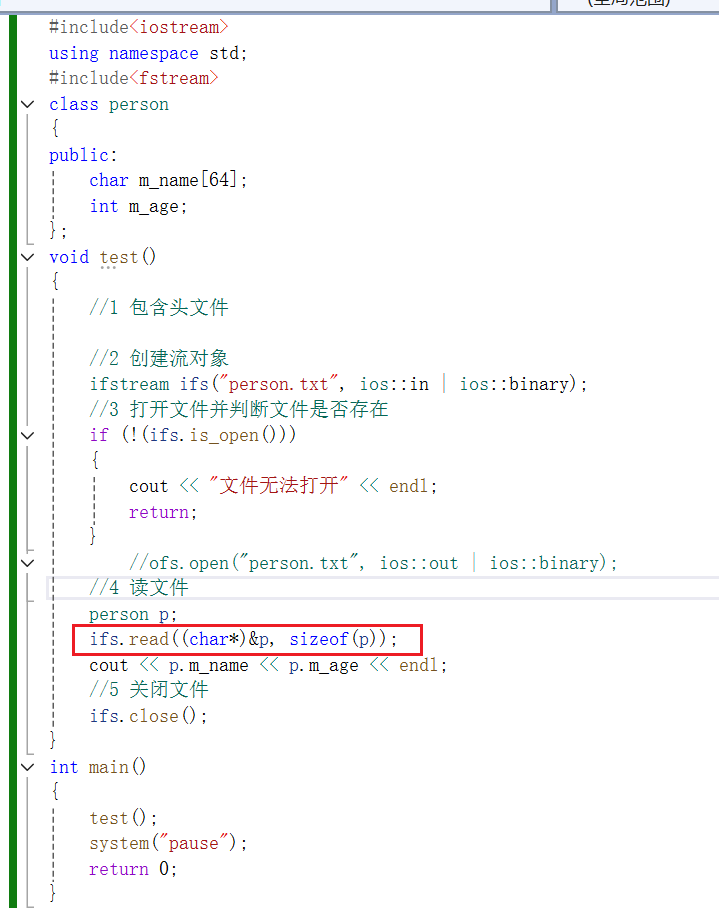

### 案例 职工管理系统

#### 1. 创建职工管理类

管理类负责的内容：

与用户的沟通菜单界面

对职工增删改查的操作

与文件的读写交互

#### 2. 菜单功能

与用户的沟通界面

##### 添加成员函数

`void show_Menu(){}`

#### 3. 退出功能

1.提供功能接口

使用 switch 

2.实现退出功能

3.测试功能

退出函数 `exit(0);`

#### 4.创建职工类

#### 5.添加职工

** 存放指针地址的指针

worker**  

表示指向worker*数组的指针

堆区开辟数组 防止函数体用完即释放的错误

#### 6. 文件交互-写文件

对文件进行读写

再上一个添加功能中，我们只是把所有的数据添加到了内存中，一旦程序结束就无法保存了。

因此文件管理类需要一个与文件进行交互的功能，对于文件进行读写

#### 7. 文件交互-读文件

 将文件内容读取到程序中

虽然我们实现了添加职工后保存到文件的操作，但是每次开始运行程序，并没有将文件中数据读取到程序中，且我们的程序功能中还有清空文件的需求。

1.第一次使用，文件未创建

2.文件存在，但是数据被用户清空

3.文件存在，并且保存职工的所有数据

##### 7.1 文件未创建

在workerManager.h中添加新的成员属性 m_FileIsEmpty 标志文件是否为空

文件未创建则将所有属性置为空

##### 7.2 文件存在且数据为空

利用ifs.eof()函数判断

##### 7.3 文件存在且保存职工数据

###### 统计职工个数

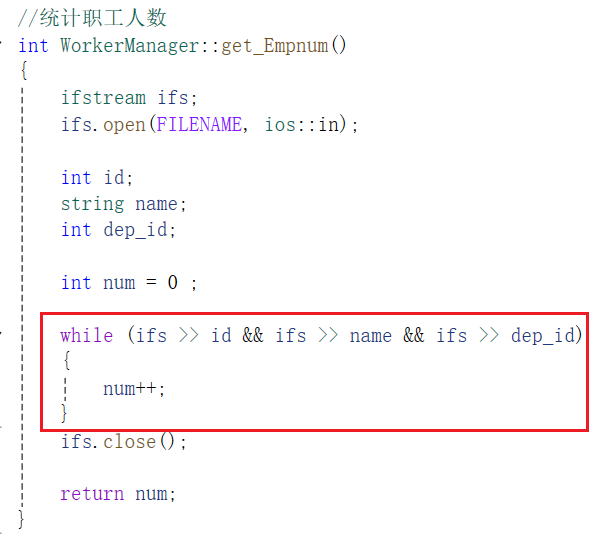

###### 初始化职工

#### 8. 显示职工

显示当前所有职工信息

#### 9. 删除职工

1.职工是否存在

2.删除职工

#### 10. 修改职工

1.判断职工是否存在

2.修改职工

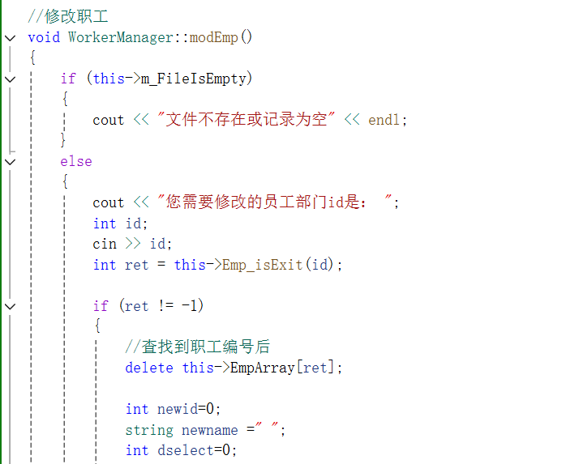

#### 11.查找职工

#### 12.职工编号排序

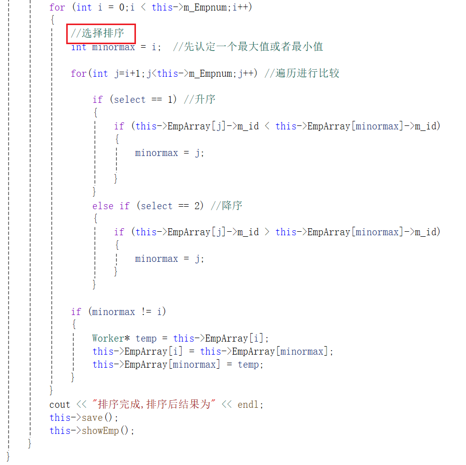

#### 13.清空文件

使用 `ofs.open(FILENAME,ios::trunc)`

且要将在堆区开辟的数据以及数组置空

##### 析构函数做出调整

#### main文件

## 三、C++提高编程

编程思想：c++泛型编程和STL技术

### 1 模板

#### 1.1 模板的概念

模板就是建立通用的模具，大大提高复用性

 c++提供两种模板机制：函数模板和类模板

#### 1.2 函数模板

##### 1.2.1 函数模板语法

函数模板作用：

建立一个通用函数，其函数的返回值类型和形参类型可以不具体制定，用一个虚拟的类型来代表。

语法：

`template<typename T>`

`函数的声明或定义`

注意事项：

自动类型推导：必须推导出**一致的数据类型**T才可以使用

显示指定类型：模板必须要**确定出T的数据类型**，才可以使用

#####  1.2.2 函数模板案例

##### 1.2.3 普通函数和函数模板的区别

普通函数调用时可以发生自动类型转换（隐式类型转换）

函数模板调用时，如果利用自动类型推导，不会发生隐式类型转换

如果利用显示指定类型的方式，可以发生隐式类型转换

##### 1.2.4 普通函数与函数模板的调用规则

调用规则：

1. 如果函数模板和普通模板都可以实现，优先调用普通函数

2. 可以通过空模板参数列表来强制调用函数模板

   `函数模板名<>(函数参数);`

3. 函数模板也可以发生重载

4. 如果函数模板可以产生更好的匹配，优先调用函数模板

注意：既然存在了函数模板，就不要定义普通函数了，防止出现二义性

##### 1.2.5 模板的局限性

模板不是万能的

提供模板的重载，可以为这些**特定的类型**提供**具体化 的模板**

#### 1.3 类模板

##### 1.3.1 类模板语法

类模板作用：建立一个通用类，类中的成员 数据类型可以不具体制定，用一个虚拟的类型来代表。

语法：

`template<typename T>`

`类`

##### 1.3.2 类模板和函数模板的区别

1. 类模板没有自动类型推导的使用方式；
2. 类模板在模板参数列表中可以有默认参数。

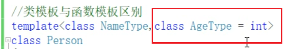

##### 1.3.3 类模板中成员函数创建时机

类模板中成员函数和普通类中成员函数创建时机是有区别的：

- 普通类中的成员函数一开始就可以创建
- 类模板中的成员函数在调用时才创建

##### 1.3.4 类模板对象做函数参数

类模板实例化出的对象，向函数传参的方式

三种传入方式：

指定传入的类型 ---直接显示对象的数据类型

参数模板化 ---将对象中的参数变为模板进行传递

整个类模板化  ---将这个对象类型 模板化进行传递

##### 1.3.5 类模板与继承

当类模板碰到继承时，需要注意以下几点：

1. 当子类继承的父类是一个类模板时，子类在声明的时候，要致电给出父类中T的类型。
2. 如果不指定，编译器无法给子类分配内存
3. 如果想灵活指定父类中T的类型，子类也需要变为类模板。

##### 1.3.6 类模板成员函数类外实现

需要加模板参数列表

##### 1.3.7 类模板分文件编写

问题：类模板中成员函数创建时机是在调用阶段，导致分文件编写时链接不到

解决：

1. 直接包含.cpp源文件
2. 将声明和实现写到同一个文件中，并更改后缀名为.hpp,hpp是约定的名称，并不是强制。

##### 1.3.8 类模板与友元

- 全局函数类内实现 --- 直接在类内声明友元即可
- 全局函数类外实现 --- 需要提前让编译器知道全局函数的存在

 友元函数 是一种特殊的全局函数，虽然它被声明在类的内部，但它不是类的成员函数。

可以看到 只是在类内实现而已，没有加什么访问权限

#### 类模板案例

测试：

测试：

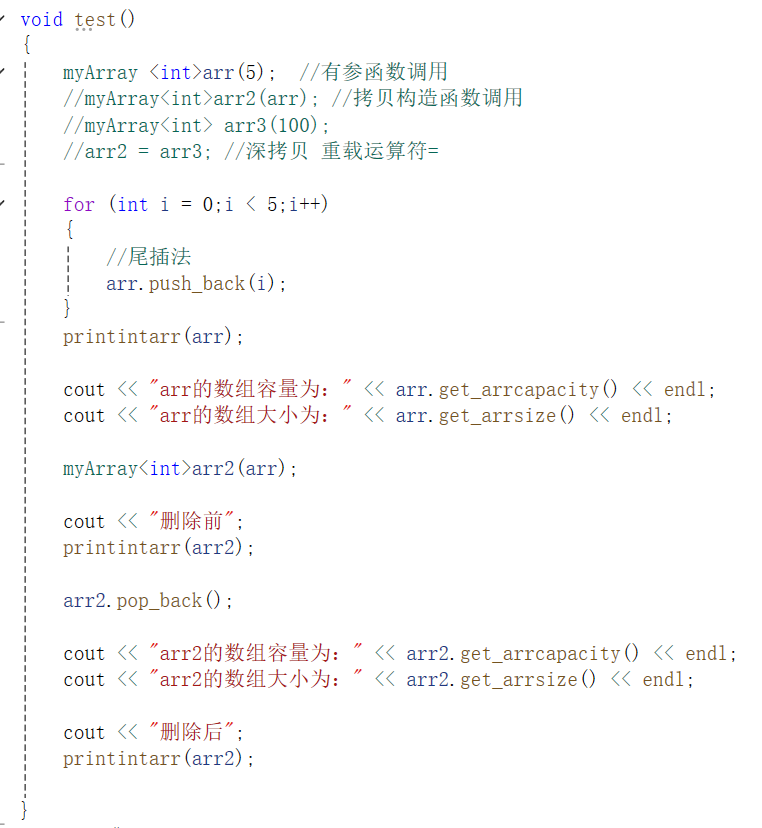

### 2. STL初识

C++的**面向对象**和**泛型编程**思想，目的就是复用性的提升

- STL（Standard Template Library，标准模板库）
- STL从广义上分为：容器（container）算法（algorithm）迭代器（iterator）
- **容器**和**算法**之间通过**迭代器**进行无缝链接
- STL几乎所有的代码都采用了模板类或者模块函数

#### 2.1 STL六大组件

STL大体分为六大组件，分别是**容器、算法、迭代器、仿函数、适配器（配接器）、空间配置器**

#####  容器

##### 算法

##### 迭代器

#### 2.2 容器算法迭代器初识

STL中最常用的容器为Vector，可以理解为数组。

下面将展示如何向这个容器中插入数据、并遍历这个容器。

##### 2.2.1 vector存放内置数据类型

容器：`vector`

算法：`for_each`

迭代器：`vector<int>::iterator`

##### 2.2.2 vector存放自定义数据类型

 

关键就是*it指的是什么 就看迭代器的类型。

##### 2.2.3 vector容器嵌套容器

#### 2.3 string容器

string本质是一个类

string和char*的区别：

- char*是一个指针

- string是一个类，类内封装了char*，管理这个字符串，是一个字符型指针的容器。

  **构造函数：**

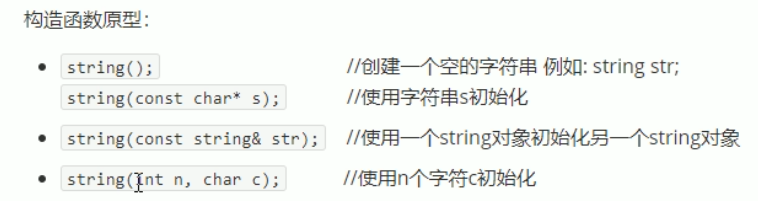

**赋值操作：**

**字符串拼接:**

**字符串查找和替换**：

 find和rfind区别：rfind从右往左查，find从左往右

**字符串比较**：

比较字符的ASCII码大小

const 意义指的是 不对字符串做任何修改

最大的意义在于 看字符串是否相等

**字符存取**

**str.size()** : 返回str字符串的长度

读方式：

写方式：

**string插入和删除：**

**string子串**

#### 2.4 vector容器

vector数据结构和数组非常相似，也称为**单端数组** 尾端做插入删除的工作

vector与普通数组的区别：不同之处在于数组是静态空间，而vector可以**动态扩展**

**动态扩展**并不是在原空间之后续接新空间，而是找更大的内存空间，然后将元数据拷贝新空间，释放原空间

**vector构造函数**

**vector赋值操作**

**vector容量和大小**

**vector的插入和删除**

**vector数据存取**

begin() 是指针（迭代器）

front() 是元素

**vector容器互换**

巧用swap可以收缩内存空间

`vector<int>(v).swap(v);`

vector<int>(v) //匿名对象 当前行执行之后会自动销毁

**vector预留空间**

减少vector在动态扩展容量时的扩展次数

`reserve();`

#### 2.5 deque容器

双端数组，可以对头端进行插入删除操作

deque和vector区别：

- vector对于头部的插入删除效率低，数据量越大，效率越低

- deque相对而言，对头部的插入删除速度会比vector快

- vector访问元素时的速度会比deque快，这和两者的内部实现有关

**deque构造函数**

**deque赋值操作**

**deque大小操作**

deque没有容量的概念，可以无限增加元素

 **deque插入和删除**

**deque数据存取**

**deque排序**

默认排序从小到大 升序

对于支持随机访问的迭代器的容器，都可以利用sort算法直接对其进行排序

vector容器也可以利用sort进行排序

#### STL案例-评委打分

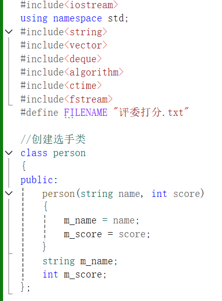

#### 2.6 stack容器

stack是一种先进先出（First In Last Out,FILO）的数据结构，它只有一个出口

栈中只有顶端的元素才可以被外界使用，因此栈不允许有遍历行为

栈可以判断容器是否为空吗？ empty();

栈可以返回容器中元素个数吗？ size();

##### 2.6.1 stack常用接口

#### 2.7 queue容器

Queue是一种先进先出（First In First Out，FIFO）的数据结构，他有两个出口

队列容器允许从一端新增元素，从另一端移除元素

队列中只有队头和队尾才可以被外界使用，因此队列中不允许有遍历行为

队列中进数据称为---入队（push）

队列中出数据称为---出队（pop）

#### 2.8 list容器

将数据进行链式存储

**链表（list）**是一种物理存储单元上非连续的存储结构，数据元素的逻辑顺序是通过链表中的指针链接实现的

 链表由一系列结点组成

结点的组成：一个是存储数据元素的**数据域**，另一个是存储下一个结点地址的**指针域**

STL中的链表是一个**双向循环链表**

**优点：**可以对任意位置进行快速插入或删除元素

**缺点：**容器的遍历速度没有数组快，不能随机存取；

占用的空间比数组大

##### 2.8.1 list构造函数

##### 2.8.2 list赋值和交换

##### 2.8.3 list大小操作

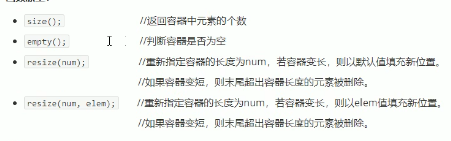

##### 2.8.4 list插入和删除

##### 2.8.5 list数据存取

list本质链表，不是用连续线性空间存储数据，迭代器也是不支持随机访问的。

##### 2.8.6 list反转和排序

所有不支持随机访问迭代器的容器，不可以用标准算法

不支持随机访问迭代器的容器，内部会提供对应一些算法

实现升序降序 使用`sort（mycompare）`

#### 排序案例

#### 2.9 set/multiset容器

set：所有元素都会在插入时**自动被排序**

**本质：**set/multiset属于关联式容器，底层结构是用二叉树实现

**两者区别：**set不允许容器里有重复元素，multiset允许

##### 2.9.1 set构造和赋值

插入数据只有 insert();

##### 2.9.2 set大小和交换

##### 2.9.3 set容器的插入和删除

##### 2.9.4 set查找和统计

查找返回的是迭代器，所以要有迭代器的定义

#####   2.9.5 pair对组创建

成对出现的数据，利用对组可以返回两个数据

**两种创建方式**

访问用 first second 就可以

##### 2.9.6 set容器排序

利用仿函数，可以改变排序规则

仿函数 就是对（）的重载

这个（）就是对 insert（）的重载 ，因为默认是从小到大

重载（）后面加const 意义是 不对传入的函数参数做任何修改，即修饰this指针。

**对内置数据类型重新排序**

**对自定义数据类型排序**

自定义数据类型 都会指定排序规则

#### 2.10 map/multimap容器

- map中所有元素都是pair

- pair中第一个元素为key（键值），起到索引作用，第二个元素为value（实值）

- 所有元素都会根据元素的键值自动排序

本质：map/multimap属于关联式容器，底层结构是用二叉树实现

优点：可以根据key值快速找到value值

map与multimap的区别：

- map不允许容器中有重复key值元素

- multimap允许容器中有重复key值元素

##### 2.10.1 map构造和赋值

插入： m.insert（pair<int,int>(1,10)）

##### 2.10.2 map的大小和交换

##### 2.10.3 map插入和删除

插入：

[ ]建议用于访问，不建议用于插入

删除：

##### 2.10.4 map查找和统计

##### 2.10.5 map容器排序

利用仿函数改变排序规则，同set容器

重载（）

#### 案例-员工分组

### 3 STL-函数对象

- 重载函数调用操作符的类，其对象称为函数对象

- 函数对象使用重载的（）时，行为类似函数调用，也叫仿函数

函数对象（仿函数）是一个类，不是一个函数。

#### 3.1 函数对象使用

函数对象使用的**特点**：

- 函数对象在使用时，可以像普通函数那样调用，可以有参数，也可以有返回值
- 函数对象超过普通函数的概念，函数对象可以有自己的状态
- 函数对象可以作为参数传递

####  3.2 谓词

返回bool类型的仿函数称为谓词

如果operator（）接受一个参数，就叫一元谓词

接受两个参数，就叫二元谓词

一元谓词：

二元谓词：

#### 3.3 内建函数对象

分类：算术仿函数、关系仿函数、逻辑仿函数

使用时，需要加头文件#include<functional>

##### 3.3.1 算术仿函数

实现四则运算

其中negate是一元运算，其他都是二元运算

##### 3.3.2 关系仿函数

##### 3.3.3 逻辑仿函数（不常用）

### 4 STL-常用算法

主要由头文件<algorithm>、<functional>、<numeric>组成

<algorithm>是所有STL头文件中最大的一个，范围涉及到比较、交换、查找、遍历操作、复制、修改等等。

<numeric>体积很小，只包括几个在序列上面进行简单数学运算的模板函数

<functional>定义了一些模板类，用以声明函数对象。

#### 4.1 常用遍历算法

`for_each  //遍历容器`

`transform //搬运容器到另一个容器中`   必须要提前开辟空间

#### 4.2  常用查找算法

`find  //查找元素`    返回迭代器，即元素所在的位置

`find _if  //按条件查找元素`

`adjacent_find  //查找相邻重复元素`

`binary_search  //二分查找法`

`count  //统计元素个数`

`count_if  //按条件统计元素个数`

**find：**

**查找内置数据类型：**

**查找自定义数据类型：**

需要重载 “==”，底层find知道如何对比person数据类型（放在person类里）

**find _if  //按条件查找元素**

**查找内置数据类型：**

需要重载（），在需要填写的第三个函数参数那里加入函数对象

**查找自定义数据类型：**

重点是谓词怎么写

**adjacent_find  //查找相邻重复元素**

 

**binary_search  //二分查找法**

作用：查找指定元素是否存在

**count  //统计元素个数**

注意自定义数据类型：要重载 ==

**count_if  //按条件统计元素个数**

 第三个函数参数 传入函数对象（谓词 布尔类型的仿函数）

  

#### 4.3 常用排序算法

sort  //对容器内元素进行排序

random_shuffle  //洗牌，指定范围内的元素随机调整次序

merge  //容器元素合并，并存储到另一个容器中

reverse  //反转指定范围的元素

**sort**

**random_shuffle**

**merge** （必须是有序序列才能合并）

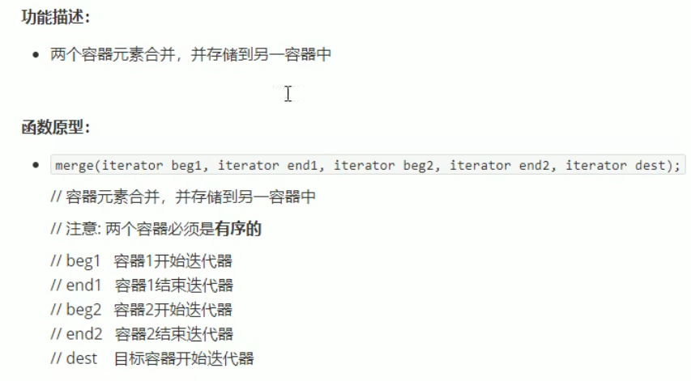

**reverse**

#### 4.4 常用拷贝和替换算法

copy  //容器内指定范围的元素拷贝到另一个容器中

replace  //将容器内指定范围的旧元素修改为新元素

replace_if  //容器内指定范围内满足条件的元素替换为新元素

swap  //互换两个容器的元素

**copy**：需要提前开辟空间

**replace**

**replace_if**

需要提供一个谓词

**swap**

#### 4.5 常用算术生成算法

**注意：**算术生成算法属于小型算法，使用时包含的头文件为

`#include < numeric >`

**算法简介：**

`accumulate  //计算容器元素累计总和`

`fill  //向容器中添加元素`

**acccumulate**

 参数3 是一个起始的累加值

**fill**

#### 4.6 常用的集合算法

`set_intersection  //求两个容器的交集`

`set_union  //求两个容器的并集`

`set_difference   //求两个容器的差集`

**set_intersection**

**set_union**

**set_difference**

## 三、知识点补充

### 1. 链表

#### 1.1 单链表

**链表初始化**

****

**取值**

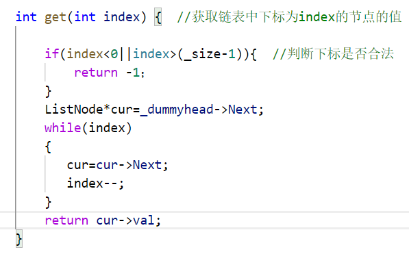

**头插法**

**尾插**

**在下标为index的节点前 加入新节点**

**删除下标为index的节点**

**打印链表**

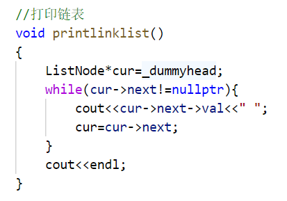

**注意目标位置这个词 在index前加入节点 那么index-1才是目标位置**

#### 1.2 循环双链表

**初始化链表**

**取值**

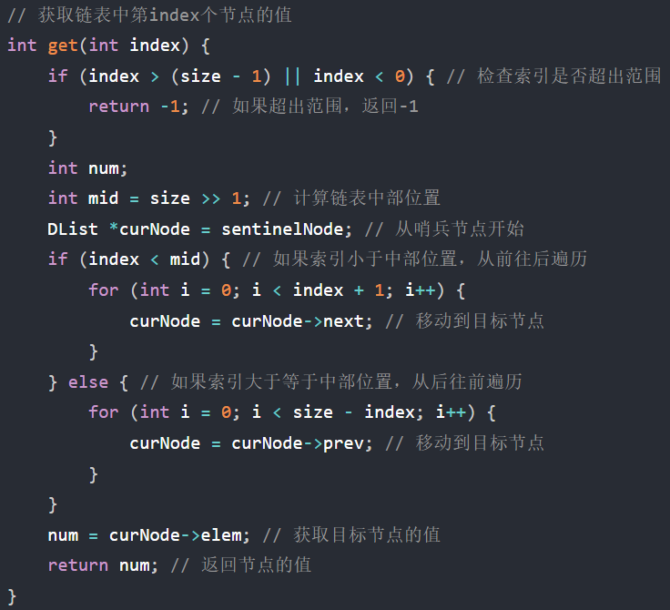

****

**头插**

保存原来的头节点

**尾插**

保存原来的尾节点

**在index下标对应元素前插入新结点**

**删除index下标对应节点**

### 2. 哈希表

**哈希表**是根据关键码的值而直接进行访问的数据结构

举例：数组就是一张哈希表，关键码就是数组的索引下标。

**作用：**快速判断一个元素是否出现在集合内

#### **2.1 哈希函数：**

**哈希碰撞：**

元素同时映射到了同一个索引下标的位置，这一现象叫做哈希碰撞。

**哈希碰撞解决方法：**

拉链法和线性探测法

**拉链法：**  查找相同键值下的某一个元素可以使用 **添加额外标识符** 的方法

在同一个索引位置发生冲突的元素被存储在链表中

好处：既不会因为数组空值而浪费大量内存，也不会因为链表太长而查找浪费太多时间

**线性探测法：** 

原则：tablesize一定要大于datasize，需要依靠哈希表的空位来解决碰撞问题

#### 2.2 常见哈希结构

- 数组

- set（集合）

- map（映射）

  

### 3. KMP算法

**`思想：`**

**`关于next数组：`**

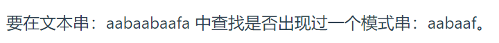

**`怎么计算前后缀，以及得到最长公共前后缀后，如何得到next[j]数组：`**

**`构造next数组：`**

**j 初始化为-1的情况：**

**j初始化为0的情况：**

### 4. 栈和队列

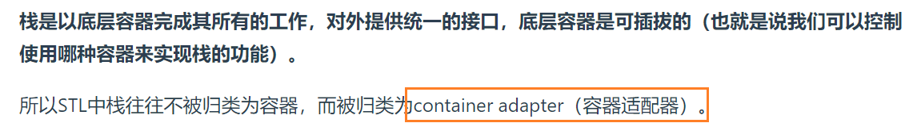

### 5. 二叉树

**链式二叉树的定义**

**递归三要素：**

1. **确定递归函数的参数和返回值**

2. **确定终止条件**

3. **确定单层递归的逻辑**

#### 5.1 二叉树的递归遍历

**前序遍历：**

**中序遍历：**

**后序遍历：**

#### 5.2 二叉树的迭代遍历

**前序遍历：**

**后序遍历：**

**中序遍历：**

